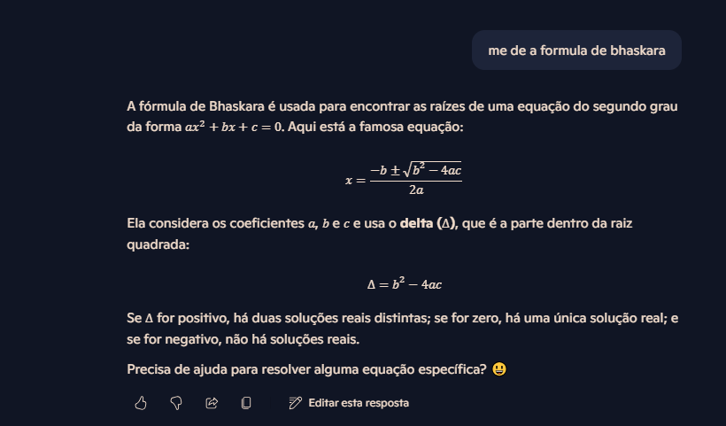

# Engenharia de Prompts

projeto realizado no curso de desenvolvimentos de sistemas

## O que é grande modelo de linguagem (LLM)?

É um tipo de algoritmo de inteligência artificial que aplica técnicas de redes neurais com diversos parâmetros para processar e compreender linguagens humanas ou textos usando técnicas de aprendizado auto supervisionado. Tarefas como geração de texto, tradução automática, codificação automática, chatbots ou IA convencional são aplicações do modelo de grandes linguagens.

## O que significa a sigla GPT?

Generative Pretrained Transformer (GPT)

GENERATIVE: Porque o modelo pode gerar textos, responder perguntas,escrever histórias, códigos e etc.

Pre- trained: Porque ele é pré treinado em uma enorme quantidade de dados da internet antes de ser ajustado para tarefas especifícas.

Transformer: é o tipo de arquitetura de rede neural usada, muito eficiente para entender e gerar linguagem natural.

 ## O que é Engenharia de Prompts?

 A engenharia de prompt é o processo de gerar prompts, ou comandos, para um modelo de inteligência artificial baseado em linguagem, como chat gpt, da open AÍ. Essa disciplina foca na formulação de comandos adequados para otimizar as respostas e a interação com o modelo de AI. Em outras palavras, gerar resultados relevantes e úteis para uma questão. 

 ##  Por que Engenharia de Prompts é crucial para Desenvolvedores de Sistemas?

A engenharia de prompts é importante para os desenvolvedores de sistemas pois ajuda a formular melhor as perguntas para o chat gpt, com o prompt bem feito, a inteligência artificial entende melhor o'que a pessoa quer, e formular melhor as respostas para deixar o sistema mais eficiente, também tem o fato de economizar o tempo e ajudar no desenvolvimento. 

## Quais são os Princípios Fundamentais da Construção de Prompts?

Saber perguntar, ter objetividade e clareza para que a IA saiba responder, explicar como deseja a resposta e ir perguntando até que o prompt fique da forma desejada. 

## Principais Ferramentas de IA Generativa Relevantes para Desenvolvimento de Sistemas.

Tem o github que ajuda a gerar códigos e funciona como um copiloto para o desenvolvedor, o chat gpt que pode identificar erros nos códigos e ajudar a desenvolvê-los. São ferramentas que auxiliam na hora da criação. 

## Técnicas de engenharia de prompt

## Prompt 1: zero shot
É uma técnica que apenas executa uma tarefa de maneira simples.

## prompt 2
## few shot

` me de a formula de bhaskara `

entrada: `
 me de a formula de bhaskara`

saida: a formula de bhaskara é utilizada para encontrar raizes de uma equação quadrática do tipo ax+ bx +c = 0

entrada: `como funciona a formula de bhaskara?`

saída: bhaskara calcula as raizes de ax +bx +c = 0 primeiro,^ =b2 - 4ac depois, x 

## prompt 3
## one-shot
utilizei essa técnica pois já dei a ela o exemplo de como eu queria minha resposta

`crie uma rotina para uma pessoa que estuda das 8h as 11h e trabalha das 15h as 3h da manhã`

com apenas um exemplo o modelo já me fornece a rotina apropriada.

 